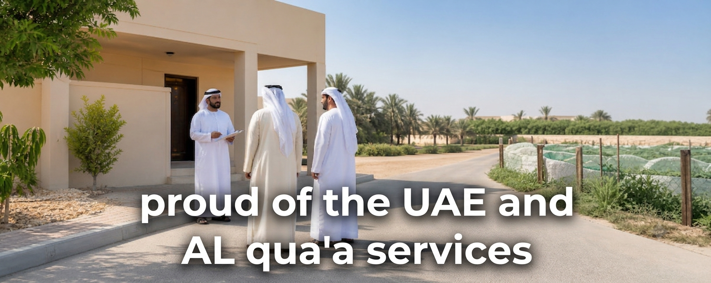
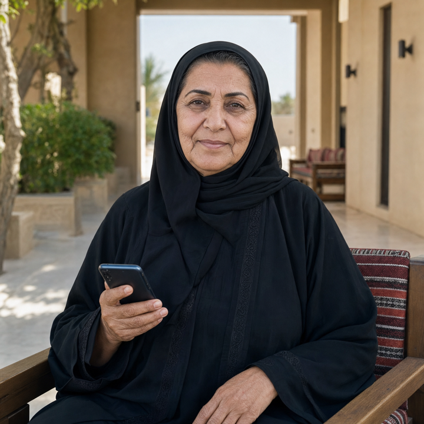

<p align="center">
  
</p>

<h1 align="center">Al Qua'a Services</h1>

<p align="center"><strong>Arabic-first local discovery for Al Qua'a residents.</strong></p>

<p align="center">
  
</p>

> Tatweer Hackathon 2026 | Challenge 4: Connecting residents to services, opportunities and events
> Built for Al Qua'a, Al Ain, UAE
> GitHub: [@WebAlikm](https://github.com/WebAlikm)

Al Qua'a Services is an Arabic-first local discovery hub that helps residents find nearby services, opportunities, and events without relying on scattered WhatsApp messages, word of mouth, or disconnected links.

## What Makes This Different

Most hackathon projects explain the work after building it. This project uses an IB Computer Science IA-inspired process to define the problem, set success criteria before coding, justify technical decisions, test the result, and evaluate it with evidence.

| IA Stage | Repo Evidence |
| --- | --- |
| Investigation | [Community insights](docs/community-insights.md), [rationale](docs/rationale.md) |
| Planning | [Success criteria](docs/success-criteria.md), [timeline](docs/timeline.md) |
| Design | [Technical justification](docs/technical-justification.md), [architecture](docs/architecture.md), [visual asset guide](docs/asset-guide.md) |
| Testing | [Evidence folder](evidence/) |
| Evaluation | Validation summary in this README |

The goal is simple: make the repository read like a planned, testable system rather than a last-minute prototype.

## Challenge and Problem

**Challenge 4:** residents are not always aware of the local services, opportunities, and events available to them, and there is no simple way to find them or stay informed.

For Al Qua'a and similar rural communities, the problem is not just internet access. The practical gap is discovery: useful information can be spread across informal chats, social posts, word of mouth, and separate official sources.

## Solution

The prototype provides:

- A searchable directory of local services, events, and opportunities.
- One-click persona lanes for families, farm owners and entrepreneurs, and seniors.
- Arabic-first layout with clear mobile navigation.
- Filters by audience, category, and urgency.
- Direct contact, WhatsApp, and map actions.
- A simple data model that can be reused by another rural community.

## Designed For Real People

> These are fictional personas synthesized from community research. Outcomes are prototype targets until validated through user testing.

<table>
  <tr>
    <td width="33%" align="center">
      <br />
      <strong>Fatima, 45</strong><br />
      Family and healthcare
    </td>
    <td width="33%" align="center">
      <br />
      <strong>Ahmed, 28</strong><br />
      Farms and business
    </td>
    <td width="33%" align="center">
      <br />
      <strong>Mariam, 67</strong><br />
      Seniors and urgent care
    </td>
  </tr>
  <tr>
    <td><strong>Needs:</strong> Find family healthcare and medicine support in Arabic.<br /><strong>Barrier:</strong> Uses mainly WhatsApp and finds multi-step portals difficult.</td>
    <td><strong>Needs:</strong> Find farm support, training, and business opportunities.<br /><strong>Barrier:</strong> Information is scattered across posts, chats, and word of mouth.</td>
    <td><strong>Needs:</strong> Reach healthcare and government-adjacent services confidently.<br /><strong>Barrier:</strong> Low digital confidence means she often depends on family.</td>
  </tr>
</table>

| Persona | Before | After with Al Qua'a Services | Target impact |
| --- | --- | --- | --- |
| **Fatima** | Calls relatives or searches forwarded messages for the right contact. | Opens **Fatima's Lane**, sees family healthcare, then calls or uses WhatsApp. | Find a relevant service in **3 clicks or fewer**, without signing in. |
| **Ahmed** | Checks multiple social posts and community chats for farm or business information. | Opens **Ahmed's Lane** for one filtered view of farm services and opportunities. | Reduce discovery to **one clear starting point** with direct action buttons. |
| **Mariam** | Waits for a family member to navigate unfamiliar websites on her behalf. | Opens **Mariam's Lane**, reads Arabic details, then uses the prominent Call action. | Make urgent service discovery possible with **one lane and one trusted action**. |

## Success Criteria

These criteria are defined before implementation and will be updated with evidence after testing.

| Criterion | Target | Evidence |
| --- | --- | --- |
| Fast access | Page loads in under 3 seconds on a throttled mobile connection | [Performance](evidence/performance.md) |
| Useful coverage | At least 20 listings across 3+ categories | [Service coverage](evidence/service-coverage.md) |
| Quick discovery | User finds a relevant listing in 3 clicks or fewer | [User testing](evidence/user-testing.md) |
| Arabic usability | Arabic layout is readable and does not break on mobile | [Screenshots](evidence/screenshots/) |
| Accessible interface | No critical accessibility issues in automated checks | [Accessibility](evidence/accessibility.md) |
| Reusable model | Services, events, and opportunities use one listing structure | [Service coverage](evidence/service-coverage.md) |

Current validation status: **0/6 tested**. The MIT license is already included, but product criteria remain pending formal testing.

## Technical Approach

The first version stays deliberately lightweight:

- Static web app.
- Vite build workflow.
- HTML, CSS, and JavaScript.
- Static JSON listing data.
- No resident login required.
- Free static hosting target.

This keeps the prototype easy to run, inspect, deploy, and test within the hackathon window. See [technical justification](docs/technical-justification.md).

## How To Run

The runnable prototype uses Vite.

```bash
npm install
npm run dev
```

Production build:

```bash
npm run build
```

## Repository Structure

```text
/
├─ README.md
├─ docs/
│  ├─ methodology.md
│  ├─ rationale.md
│  ├─ success-criteria.md
│  ├─ technical-justification.md
│  ├─ timeline.md
│  ├─ community-insights.md
│  ├─ asset-guide.md
│  └─ architecture.md
├─ evidence/
│  ├─ README.md
│  ├─ performance.md
│  ├─ user-testing.md
│  ├─ service-coverage.md
│  ├─ accessibility.md
│  └─ screenshots/
├─ assets/
│  ├─ alqua-services-pride-banner.png
│  ├─ persona-fatima.png
│  ├─ persona-ahmed.png
│  └─ persona-mariam.png
├─ data/
├─ src/
├─ public/
├─ index.html
├─ package.json
└─ LICENSE
```

## Methodology Note

Data synthesized using Abu Dhabi Census reports, TDRA digital government and telecom context, UAE digital adoption metrics, Tatweer Hackathon challenge material, and regional community news coverage of the Al Ain desert region. Village-level Al Qua'a demographic figures were not found in public official sources, so this repo labels regional or national proxy data clearly.
