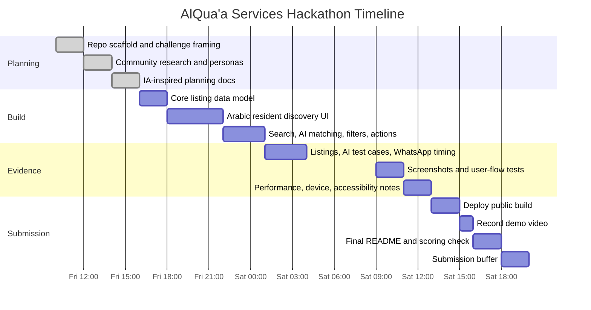

# Timeline and Gantt Chart

This timeline is designed for the Tatweer Hackathon deadline: Saturday 27 June 2026, 8:00 PM GST.

## Work Phases

| Phase | Time Window | Output |
| --- | --- | --- |
| Strategy and setup | Friday morning | Challenge selected, repo scaffolded, README structure added |
| Research and planning | Friday midday | Community insights, rationale, success criteria, rubric docs |
| Core build | Friday afternoon to evening | Working resident discovery flow, listing data model, Arabic RTL base |
| Data and evidence | Friday night | 20+ listings, AI query test set, WhatsApp timing test plan |
| Polish and deployment | Saturday morning | Responsive UI, run instructions, deployment, accessibility pass |
| Validation | Saturday midday | User-flow testing, performance notes, screenshots, device checks |
| Submission prep | Saturday afternoon | Demo video, final README, scoring tracker, submit repo |

## Realism Check

The timeline is still realistic only if scope stays narrow:

- AI means intent matching against local listings, not a general chatbot.
- WhatsApp means a measurable share or delivery flow, not a full broadcast system.
- User testing can target 15 people, but a smaller sample must be documented honestly if time runs out.
- New features stop during the final submission buffer.

## Mermaid Gantt Chart

## Critical Path

1. Working listing data.
2. Arabic RTL resident UI.
3. Search, filters, and AI-assisted query matching.
4. Contact, WhatsApp, and map actions.
5. Evidence and screenshots.
6. README finalization.

## Submission Buffer

The final two hours before the deadline should be reserved for:

- GitHub refresh check.
- Live demo link check.
- README review.
- Demo video link check.
- Submission form completion.

No major new features should be added during the submission buffer.
